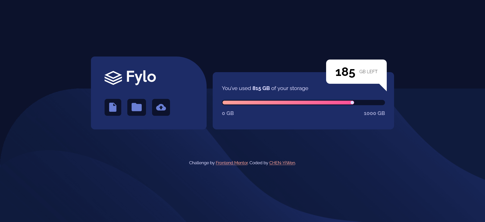

# Frontend Mentor - Fylo data storage component solution

This is a solution to the [Fylo data storage component challenge on Frontend Mentor](https://www.frontendmentor.io/challenges/fylo-data-storage-component-1dZPRbV5n). Frontend Mentor challenges help you improve your coding skills by building realistic projects. 

## Table of contents

- [Overview](#overview)
  - [The challenge](#the-challenge)
  - [Screenshot](#screenshot)
  - [Links](#links)
- [My process](#my-process)
  - [Built with](#built-with)
  - [What I learned](#what-i-learned)
  - [Continued development](#continued-development)
  - [Useful resources](#useful-resources)
- [Author](#author)
- [Acknowledgments](#acknowledgments)

**Note: Delete this note and update the table of contents based on what sections you keep.**

## Overview

### The challenge

Users should be able to:

- View the optimal layout for the site depending on their device's screen size

### Screenshot

### Links

- Solution URL: [Github](https://github.com/CHEN-YiWen/Fylo-data-storage-component)
- Live Site URL: [live site hosted by Github](https://your-live-site-url.com)

## My process

### Built with

- Semantic HTML5 markup
- CSS custom properties
- Flexbox

### What I learned

- I use <code>progress</code> for the progress bar. However, I find it is hard to style it because I have to use presudo element <code>::-moz-progress-bar</code> and <code>::-webkit-progress-value</code>.

- The part I struggle the most is positioning the white dot on the progress bar. At first I tried <code>::after</code> on the container <code>.bar</code>. But the position of the code would not stick in the same place. After checking out [MRZ.Code.Manufacture]'s(https://www.youtube.com/channel/UC8vDv2c3-wQfTnOr84CwH4Q) solution, I decided to make the dot as a <code>div</code>, which turned out to be way simpler to manipulate! 

### Continued development

- I would like to add a simple animation to the progress bar.

- I am trying to figure out how to create a speech bubble without the help of the generator.

### Useful resources

- [CSS Gradient](https://cssgradient.io/) - By entering the color codes and adjusting the style, I can easily create desired gradient background. 
- [CSS speech bubbles made easy](http://projects.verou.me/bubbly/) - I used this website to create the speech bubble.

## Author

- Frontend Mentor - [@CHEN-YiWen](https://www.frontendmentor.io/profile/CHEN-YiWen)

